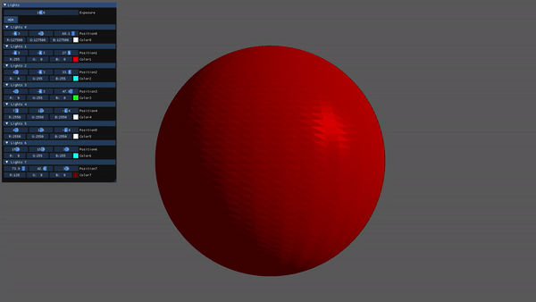
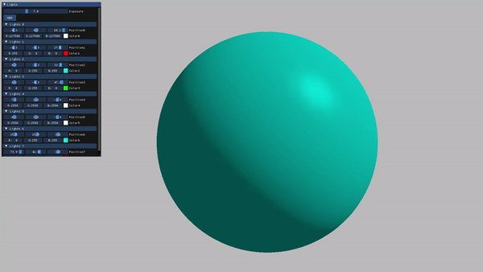
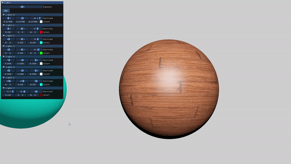
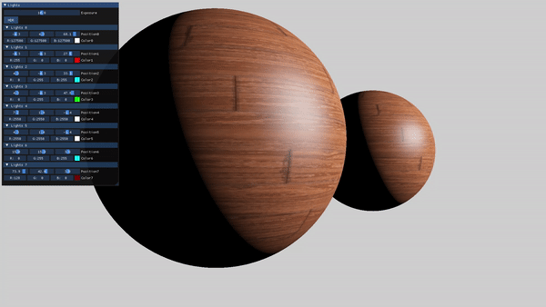
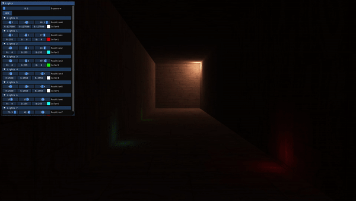

# Project Graphics Effects

**Authors : Lise Omaya, Vincent Devine**

For ISART Digital

 

## **Project description :**
With this projet our aim was to work on graphics effects. We did several types of lights (Flat, Gouraud, Phong and Blinn-Phong) and created a HDR (High Dynamic Range) effect. 

## **To build and run the project :** 
Open the project in Visual Studio and start this (F5).
 

## **Commands :**
- W/S : Move forward/backward
- A/D : Move left/right
- Space : Activate/Desactivate HDR
- Right click : Look around
- ESC : Return to menu
 

 **Flat Light** 

 **Gouraud Light** 

  **Phong Light** 

   **Blinn-Phong Light**  

 

   **HDR**  

## **Hardest parts**
- Manage several shaders

## **TODO**
- Make bloom effect coupled with HDR

 

Code editor : Visual Studio Community  
System : Windows